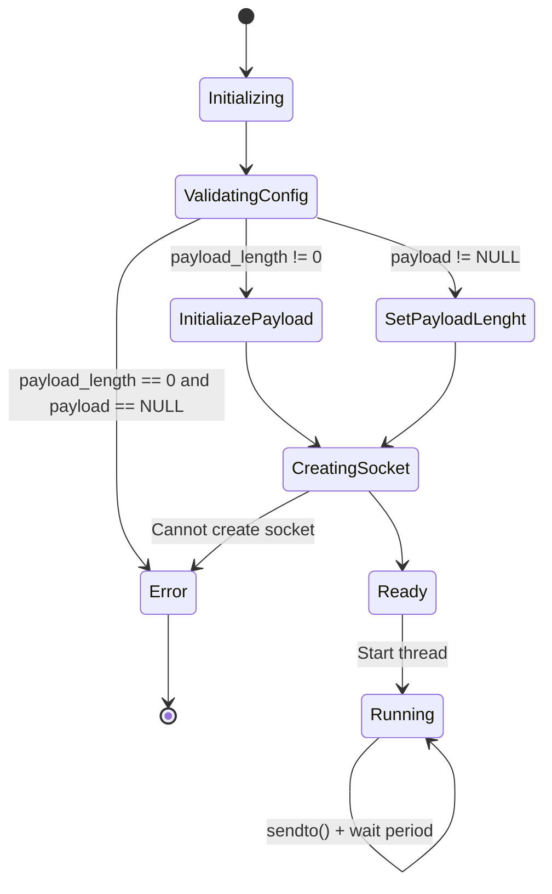
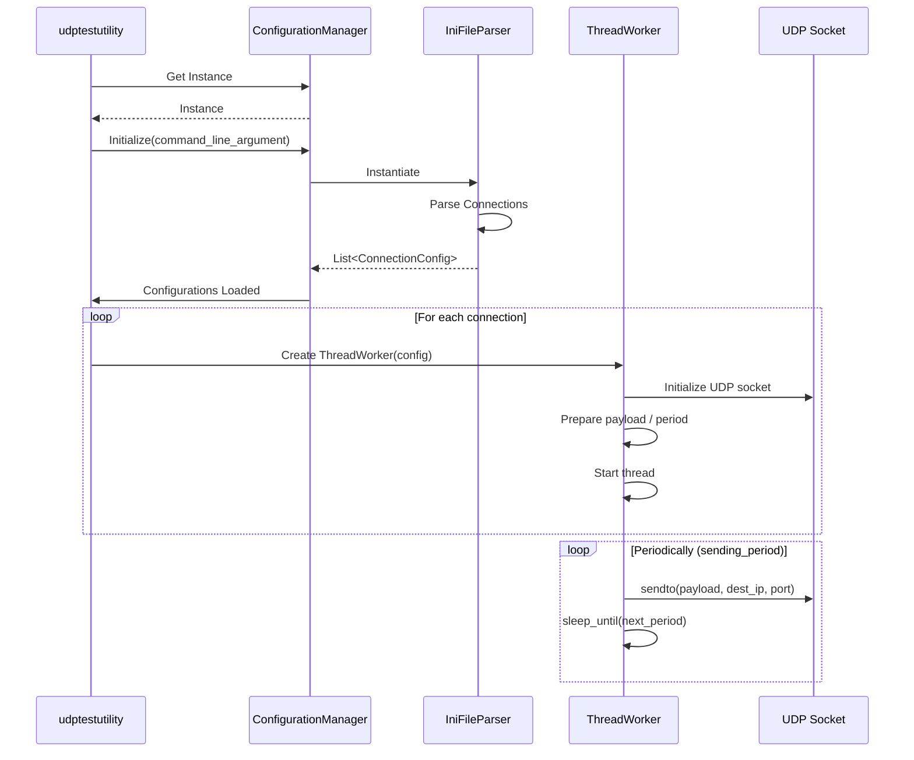

## Initialization Flow

```mermaid
stateDiagram-v2
    [*] --> Initializing

    Initializing --> ValidatingConfig
    ValidatingConfig --> Error : payload_length == 0 and payload == NULL
    ValidatingConfig --> InitialiazePayload : payload_length != 0
    ValidatingConfig --> SetPayloadLenght : payload != NULL
    SetPayloadLenght --> CreatingSocket
    InitialiazePayload --> CreatingSocket

    CreatingSocket --> Error : Cannot create socket
    CreatingSocket --> Ready

    Ready --> Running : Start thread
    Running --> Running : sendto() + wait period

    Error --> [*]
```

## Initialization Sequence

```mermaid
sequenceDiagram
    participant Main as udptestutility
    participant Manager as ConfigurationManager
    participant Parser as IniFileParser
    participant Worker as ThreadWorker
    participant Socket as UDP Socket

    Main->>Manager: Get Instance
    Manager-->>Main: Instance
    Main->>Manager: Initialize(command_line_argument)
    Manager->>Parser: Instantiate
    Parser->>Parser: Parse Connections
    Parser-->>Manager: List<ConnectionConfig>
    Manager->>Main: Configurations Loaded

    loop For each connection
        Main->>Worker: Create ThreadWorker(config)
        Worker->>Socket: Initialize UDP socket
        Worker->>Worker: Prepare payload / period
        Worker->>Worker: Start thread
    end

    loop Periodically (sending_period)
        Worker->>Socket: sendto(payload, dest_ip, port)
        Worker->>Worker: sleep_until(next_period)
    end
```
